# GestionBibliotecaLab

Sistema de Gestión de Biblioteca y Reserva de Laboratorios para una institución educativa. Permite a estudiantes y docentes consultar el catálogo de libros y laboratorios, y a Administradores/Bibliotecarios gestionar préstamos, reservas, penalizaciones, usuarios y catálogo de forma centralizada.

- **Backend**: API REST en .NET 10 + Entity Framework Core 10 (Database-First / Scaffolding) sobre SQL Server.
- **Frontend**: Angular 21 (Standalone Components, Signals, Zoneless Change Detection).


---

## Tabla de contenidos

- [Características principales](#características-principales)
- [Actores y roles del sistema](#actores-y-roles-del-sistema)
- [Capturas de pantalla](#capturas-de-pantalla)
- [Arquitectura](#arquitectura)
  - [Backend](#backend)
  - [Frontend](#frontend)
- [Stack tecnológico](#stack-tecnológico)
- [Estructura del repositorio](#estructura-del-repositorio)
- [Puesta en marcha](#puesta-en-marcha)
- [Seguridad](#seguridad)

---

## Características principales

- Autenticación con **JWT de vida corta + Refresh Token con rotación de un solo uso** y detección/contención de reuso (robo de token) sin afectar sesiones legítimas.
- **Control de concurrencia optimista (RowVersion)** en Libro y Laboratorio, con contrato explícito de Base64 entre API y Angular.
- **Paginación y filtrado server-side** unificados (`PaginacionResultado<T>`) para los 6 módulos con volumen de datos: Libro, Laboratorio, Usuario, Préstamo, Reserva, Penalización.
- **Soft delete** transversal vía Global Query Filter + vistas de "eliminados/reactivación" en el frontend para Libro, Laboratorio y Usuario.
- Gestión completa de **préstamos** (registro, devolución con detección de mora automática, renovación) y **reservas de laboratorio** (validación de solapamiento de horario en dos niveles: aplicación + índice único de BD).
- **Penalizaciones unificadas por origen** (Préstamo | Reserva de Laboratorio) con un único endpoint y DTO, reflejando la restricción `CHECK` de la base de datos.
- Subida de imágenes (portada de libro, imagen de laboratorio) a disco local con validación de tipo/tamaño, listo para migrar a Azure Blob Storage sin tocar la capa de aplicación.
- **Jobs en segundo plano**: limpieza de refresh tokens expirados, generación automática de moras por préstamos vencidos, transición automática de estados de reservas (Confirmada→Finalizada, Pendiente→Cancelada).
- Frontend con **Design System propio**: tokens de espaciado/tipografía/elevación, componentes de presentación reutilizables (`PageHeader`, `StatusBadge`, `EmptyState`, `EntitySelect`, `Paginador`, `ConfirmModal`, `ModalShell`, `CoverImagen`, `FichaDetalle`) y patrones de listado consistentes (catálogo de fila numerada vs. grid de tarjetas, según la entidad tenga o no imagen/datos complejos).

## Actores y roles del sistema

| Rol | Permisos |
|---|---|
| **Administrador** | Acceso total: gestión de catálogo (Libro/Laboratorio/Categoría), usuarios, roles, préstamos, reservas y penalizaciones. |
| **Bibliotecario** | Gestiona préstamos, reservas y penalizaciones (registrar, devolver, renovar, confirmar, cancelar, resolver, anular). Sin acceso a la gestión de Libro/Laboratorio/Categoría/Usuario/Rol. |
| **Docente** / **Estudiante** | Consulta el catálogo de libros y laboratorios, y su propio historial (`Mis Préstamos`, `Mis Reservas`, `Mis Penalizaciones`). El registro de préstamos y reservas **no es autoservicio**: siempre lo efectúa Administrador o Bibliotecario a nombre del solicitante. |

---

## Capturas de pantalla

> _Sección pendiente de completar con imágenes reales del sistema en ejecución. Se recomienda una subcarpeta `docs/screenshots/` en el repositorio y enlazar cada imagen aquí._


### Autenticación

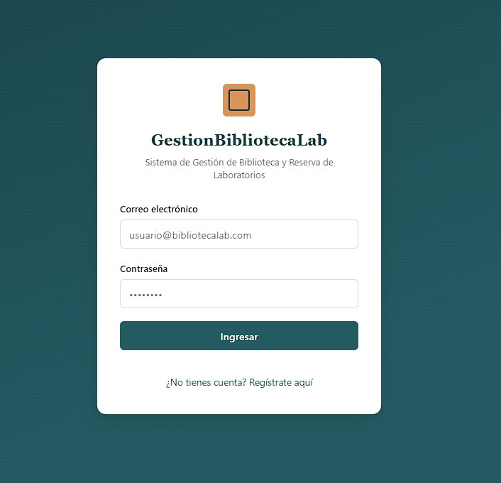

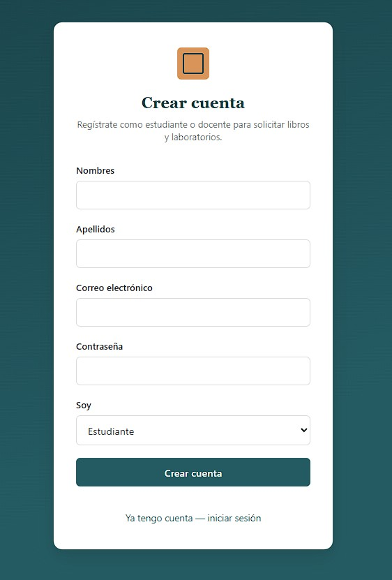

### Dashboard

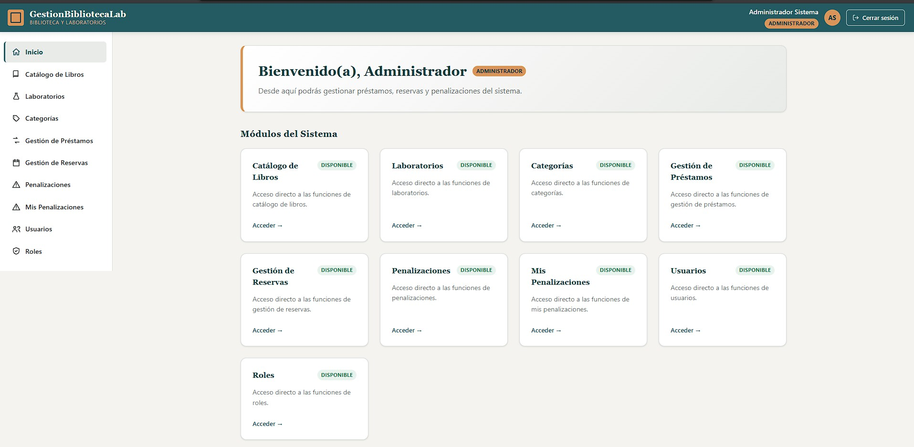

### Catálogo de Libros

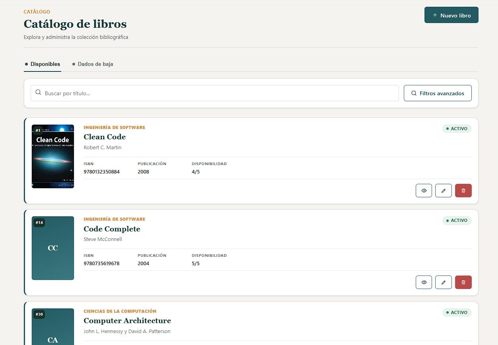

### Laboratorios

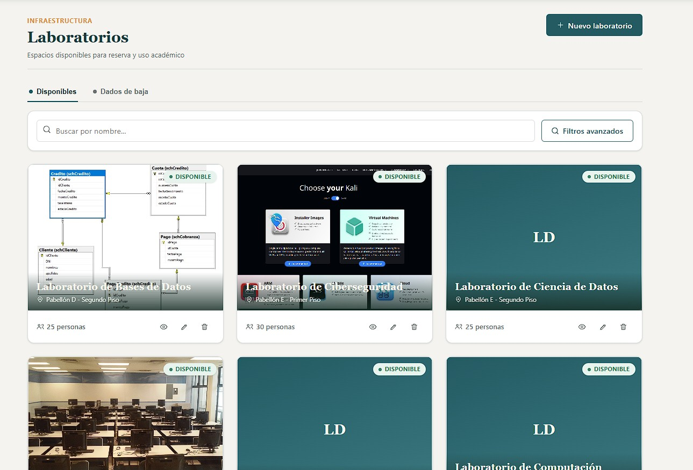

### Categorías

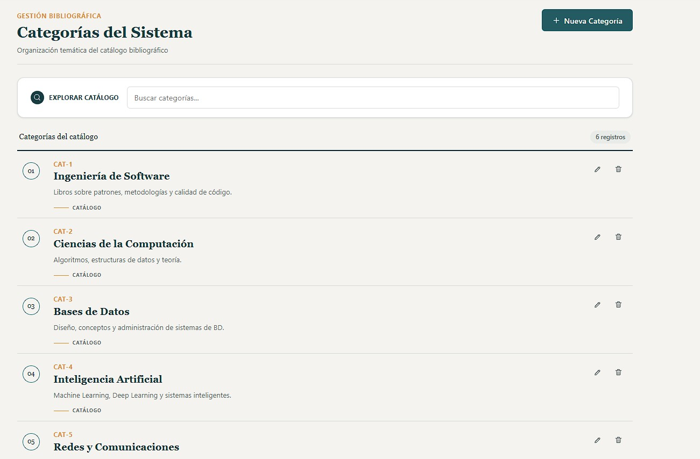


### Gestión de Préstamos

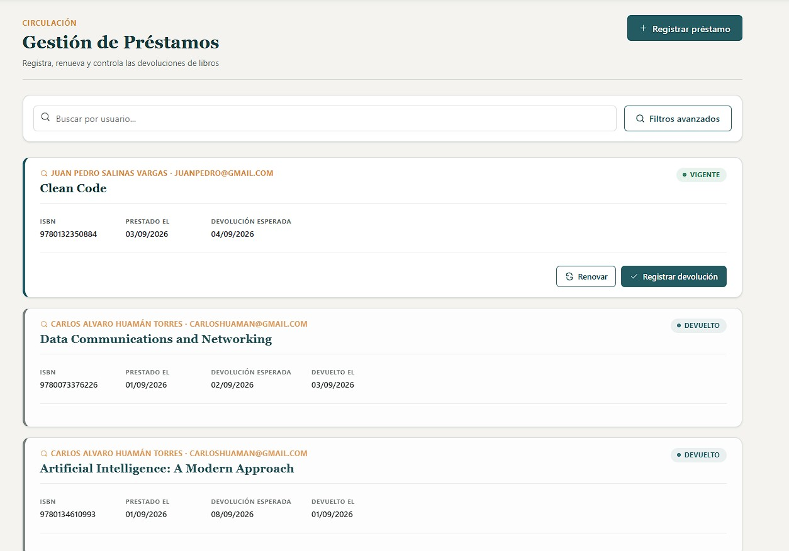


### Mis Préstamos (Estudiante/Docente)

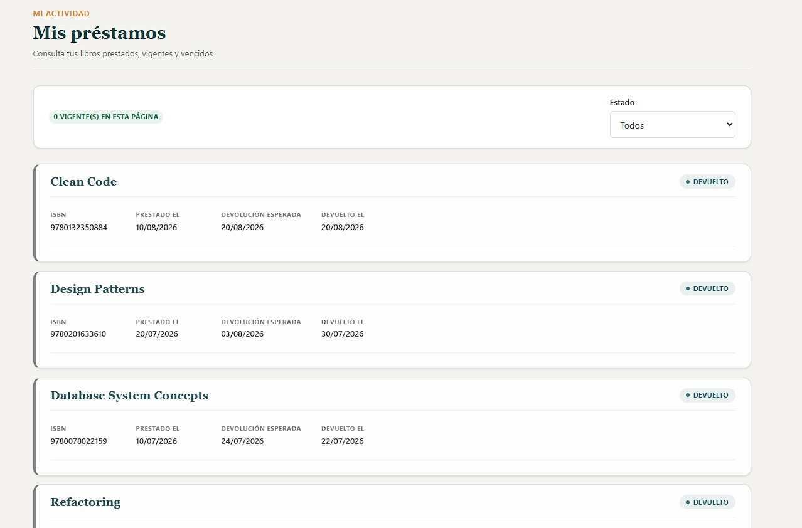


### Gestión de Reservas

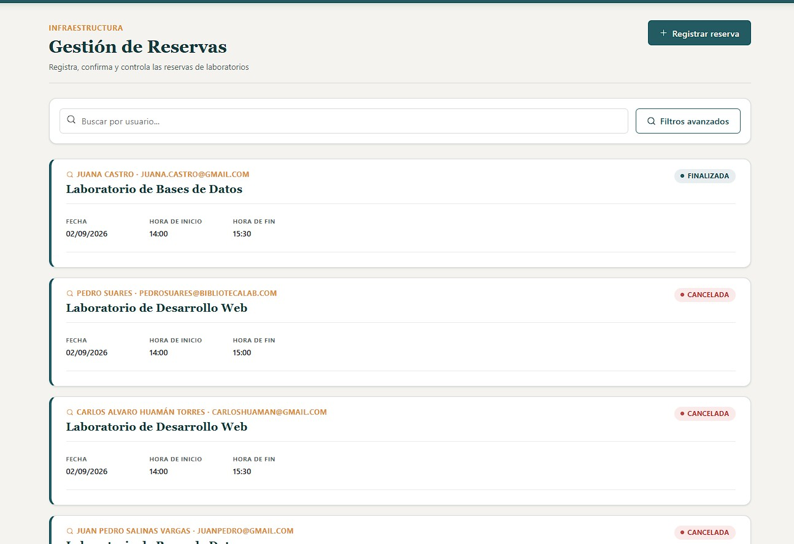

### Mis Reservas (Estudiante/Docente)

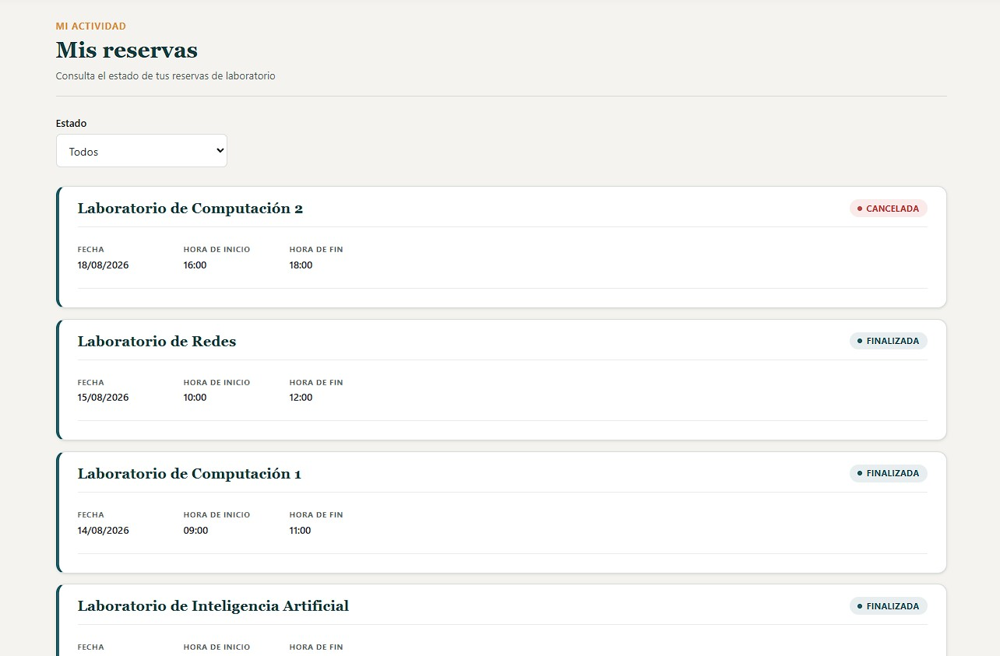 


### Gestión de Penalizaciones

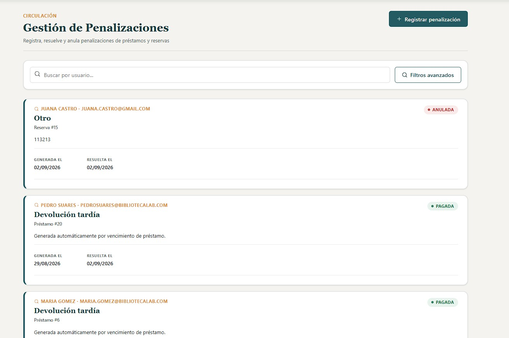

### Mis Penalizaciones (Estudiante/Docente)

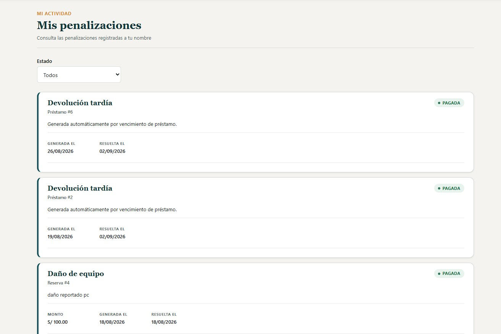


### Usuarios y Roles (Administrador)

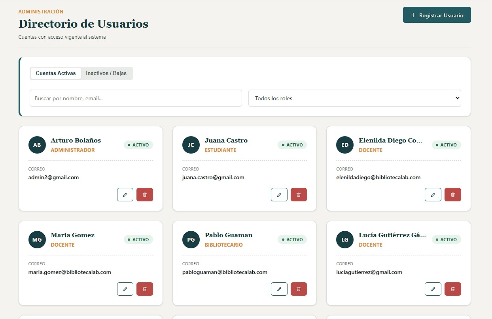 

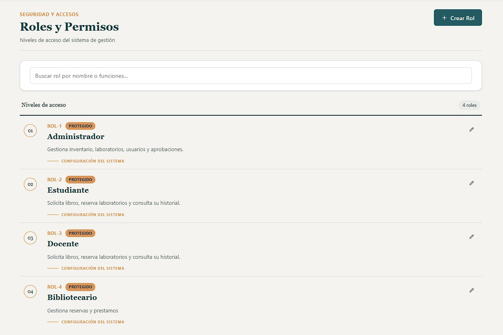 


---

## Arquitectura

### Backend

Arquitectura por capas, con acceso a datos **Database-First** (el esquema SQL es la fuente de verdad; el código C# se regenera vía `dotnet ef dbcontext scaffold`):

```
GestionBibliotecaLab.Dominio          → Entidades scaffoldeadas + Enums + extensiones parciales. Sin dependencias externas.
GestionBibliotecaLab.Infraestructura  → AppDbContext (soft delete global + auditoría vía SaveChanges) + Jobs sin lógica de negocio.
GestionBibliotecaLab.Aplicacion       → Interfaces + implementaciones de servicios, DTOs, validaciones, seguridad (JWT/BCrypt), jobs con lógica de negocio.
GestionBibliotecaLab.Presentacion.API → Controladores REST, middleware de manejo de errores, Program.cs, utilidades ligadas a HTTP.
```

### Frontend

```
src/app/
├── core/          → constants, guards, interceptors, utils transversales
├── models/         → interfaces TS, espejo de los DTOs del backend
├── services/       → un servicio HTTP por entidad, sin lógica de presentación
├── components/
│   ├── layout/      → Header, Sidebar (off-canvas), MainLayout
│   └── shared/       → componentes de presentación reutilizables (leaf components)
└── pages/           → un módulo por entidad (listado/formulario/detalle)
```

---

## Stack tecnológico

**Backend**
- .NET 10 / ASP.NET Core Web API
- Entity Framework Core 10 (SQL Server, Database-First)
- BCrypt.Net-Next (hashing de contraseñas, factor de trabajo 12)
- System.IdentityModel.Tokens.Jwt + JwtBearer (autenticación)
- Swashbuckle (Swagger/OpenAPI con soporte Bearer)

**Frontend**
- Angular 21 (CLI 21.2.0) — Standalone Components, Signals, Zoneless
- RxJS (interoperabilidad `toSignal`/`toObservable`)
- Reactive Forms
- CSS puro con sistema de tokens propio (sin librerías de UI externas)

**Base de datos**
- SQL Server 
---

## Estructura del repositorio

```
/
├── GestionBibliotecaLab.Dominio/
├── GestionBibliotecaLab.Infraestructura/
├── GestionBibliotecaLab.Aplicacion/
├── GestionBibliotecaLab.Presentacion.API/
├── GestionBibliotecaLab.Presentacion.Web/   (Angular)
├── SistemaBibliotecaLabDb.sql               (script de base de datos)
└── docs/
    └── screenshots/                         (imágenes referenciadas)
```

---

## Puesta en marcha

### Requisitos previos
- .NET SDK 10
- SQL Server (local o instancia accesible)
- Node.js 20 + npm 10
- Angular CLI 21.2.0

### Backend

```bash
# 1. Crear la base de datos ejecutando el script versionado
#    (crea tablas, índices, constraints, seed de Roles/Categorías/Usuarios/Libros/Laboratorios)
sqlcmd -S localhost -i SistemaBibliotecaLabDb.sql

# 2. Configurar la cadena de conexión y la clave JWT (User Secrets, nunca en appsettings.json)
cd GestionBibliotecaLab.Presentacion.API
dotnet user-secrets set "Jwt:SigningKey" "<clave-de-al-menos-32-caracteres>"

# 3. Levantar la API
dotnet run
# Swagger disponible en https://localhost:7015/swagger
```

> Si el esquema SQL cambia, regenerar las entidades con:
> ```bash
> dotnet ef dbcontext scaffold "Data Source=localhost;Database=SistemaBibliotecaLabDb;Trusted_Connection=True;TrustServerCertificate=True;" Microsoft.EntityFrameworkCore.SqlServer --output-dir ../GestionBibliotecaLab.Dominio/Entidades --context-dir Context --context AppDbContext --namespace GestionBibliotecaLab.Dominio.Entidades --context-namespace GestionBibliotecaLab.Infraestructura.Context --force
> ```

### Frontend

```bash
cd GestionBibliotecaLab.Presentacion.Web
npm install
ng serve
# Disponible en http://localhost:4200
```

### Usuarios de prueba (seed)

| Email | Contraseña | Rol |
|---|---|---|
| admin@bibliotecalab.com | Admin123! | Administrador |
| juan.perez@bibliotecalab.com | Estudiante123! | Estudiante |
| maria.gomez@bibliotecalab.com | Docente123! | Docente |

---

## Seguridad

- Access Token JWT de vida corta (20 min por defecto) + Refresh Token de un solo uso, con rotación y **detección de reuso limitada a la cadena comprometida** (evita que un token robado provoque una denegación de servicio persistente sobre sesiones legítimas posteriores).
- Refresh Tokens se almacenan **hasheados con SHA-256**, nunca en texto plano.
- Contraseñas hasheadas con **BCrypt** (factor de trabajo 12).
- Mensajes de login genéricos ante credenciales inválidas, para evitar enumeración de usuarios.
- CORS configurado explícitamente por política nombrada, con orígenes controlados vía `appsettings`.
- Auto-protección: ningún usuario puede desactivar su propia cuenta.
- Endpoints "propios" (`mis-*`) siempre resuelven el usuario desde el token, nunca desde parámetros de query enviados por el cliente.

---
